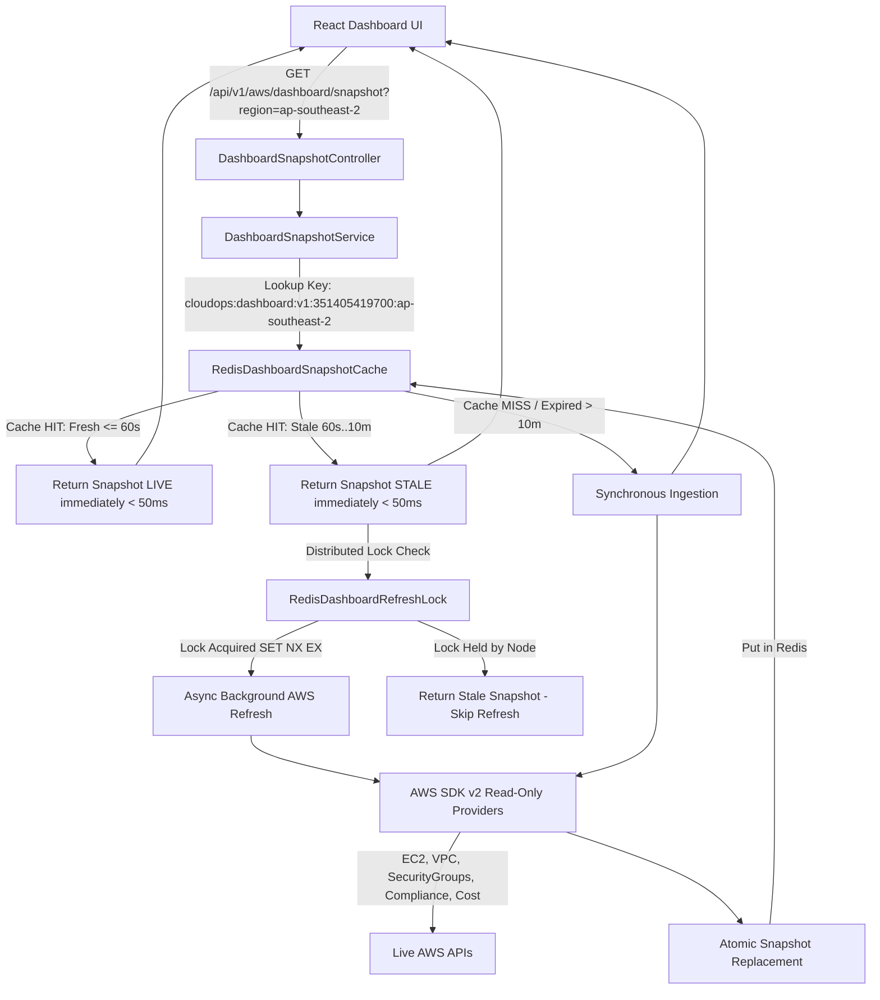

# DASHBOARD SNAPSHOT CACHE ARCHITECTURE

- **System Identifier**: `DASHBOARD_SNAPSHOT_CACHE_ARCHITECTURE`
- **Specification Version**: `14.0.0` (Phase 45 Production Deployment & ECS Task Registration Certification)
- **Target Runtime**: CloudOps Manager Backend (Spring Boot 3 + AWS SDK v2 + Redis)
- **Primary Objective**: Eliminate 30–45s synchronous AWS analytical latency via Distributed Stale-While-Revalidate (SWR) Redis Snapshot Caching.

---

## 1. Architectural Overview & Context

Phase 45 executed the **Production Deployment & ECS Task Registration Certification** for CloudOps Manager:

```
                    React Dashboard UI
                           |
                           v
                     Load Balancer
                     /           \
                    v             v
             Backend Node A  Backend Node B
                    \             /
                     \           /
             Redis (Distributed Cache & Lock)
                           |
                           v
                    Live AWS APIs
```

- **Pluggable Cache Abstraction**: `DashboardSnapshotCache` is implemented as `RedisDashboardSnapshotCache` for distributed production environments and `InMemoryDashboardSnapshotCache` for local development/unit testing.
- **Distributed Refresh Lock**: `RedisDashboardRefreshLock` utilizes atomic `SET key token NX EX leaseSeconds` and Lua script release token verification to prevent cross-node refresh storms across multiple backend containers.
- **Strict Account & Region Isolation**: Keys are namespaced as `cloudops:dashboard:v1:{accountId}:{region}` and locks as `cloudops:dashboard:refresh:{accountId}:{region}`.



---

## 2. Snapshot Contract & Data Provenance Model

The `DashboardSnapshot` DTO encapsulates the complete analytical surface with versioning and per-subsystem metadata:

```json
{
  "success": true,
  "data": {
    "accountId": "351405419700",
    "region": "ap-southeast-2",
    "snapshotStatus": "LIVE",
    "generatedAt": "2026-08-27T11:00:00Z",
    "lastSuccessfulRefreshAt": "2026-08-27T11:00:00Z",
    "resources": {
      "status": "LIVE",
      "source": "AWS_RESOURCE_DISCOVERY",
      "data": { "totalCount": 11, "account": "351405419700", "region": "ap-southeast-2" }
    },
    "topology": {
      "status": "LIVE",
      "source": "AWS_TOPOLOGY_BUILDER",
      "data": { "nodeCount": 14, "edgeCount": 5 }
    },
    "compliance": {
      "status": "LIVE",
      "source": "AWS_COMPLIANCE_ENGINE",
      "data": { "totalRulesEvaluated": 6, "passCount": 4, "failCount": 2 }
    },
    "costs": {
      "status": "LIVE",
      "source": "AWS_COST_EXPLORER_ACCOUNT_WIDE",
      "data": { "billingScope": "ACCOUNT_WIDE", "metric": "UnblendedCost", "totalAmount": 0.00 }
    }
  }
}
```

---

## 3. Distributed Redis Lock & Single-Flight Policy

To prevent cross-instance refresh storms:
- **Lock Key**: `cloudops:dashboard:refresh:{accountId}:{region}`
- **Atomic Acquisition**: `SET lockKey token NX EX 120` (Returns `true` only to the winning backend instance).
- **Safe Atomic Release**: Lua script compares token before deleting lock:
  ```lua
  if redis.call('get', KEYS[1]) == ARGV[1] then
      return redis.call('del', KEYS[1])
  else
      return 0
  end
  ```
- **Fallback Policy**: If Redis is unavailable, log `REDIS_UNAVAILABLE` warning and safely proceed without crashing or deadlocking.

---

## 4. TTL & Stale-While-Revalidate (SWR) Policy

Freshness rules are configuration-driven via environment variables in `application.yml`:

```yaml
cloudops:
  dashboard:
    cache:
      type: ${DASHBOARD_CACHE_TYPE:memory} # "redis" for distributed production, "memory" for local dev
    snapshot:
      fresh-ttl-seconds: ${DASHBOARD_FRESH_TTL:60}
      stale-ttl-seconds: ${DASHBOARD_STALE_TTL:600}
      refresh-lock-ttl-seconds: ${DASHBOARD_LOCK_TTL:120}
```

---

## 5. Security & Isolation Governance

- **Tenant & Region Isolation**: Keys incorporate explicit account and region parameters (`cloudops:dashboard:v1:{accountId}:{region}`).
- **Analytical Read-Only Boundary**: `AWS_MUTATIONS = 0`, `IAM_MUTATIONS = 0`.
- **Backend-Only Credentials**: Frontend has zero `@aws-sdk` or Redis SDK imports.
- **Zero Fake Data**: Fallback mock values are strictly forbidden (`STATIC_BUSINESS_DATA = 0`).

---

## 6. Multi-Instance Runtime Behavior & Concurrency Certification

Phase 43C certified the following runtime behaviors across concurrent multi-threaded execution and multi-process architecture integration:

1. **Redis Shared Snapshot Store**: Both Backend Instance A and Backend Instance B read and write to the same central Redis snapshot key (`cloudops:dashboard:v1:{accountId}:{region}`).
2. **Single-Flight Refresh Locking**: Under a burst of 20 concurrent requests across nodes, exactly 1 node acquires the distributed refresh lock and executes AWS ingestion. The remaining 19 requests return the cached snapshot immediately.
3. **Lock Ownership & Token-Safe Release**: Distributed lock tokens (UUIDs) prevent Node B from releasing or overwriting Node A's lock.
4. **Lock Expiration Recovery**: If Node A crashes while holding the lock, the lock automatically expires after `refresh-lock-ttl-seconds` (120s), allowing Node B to acquire the lock cleanly without permanent deadlocks.
5. **Atomic Snapshot Replacement**: Complete snapshots are serialized and replaced atomically in Redis (`DASHBOARD_SNAPSHOT_ATOMIC_REPLACE`), guaranteeing readers never observe partial writes or broken JSON.
6. **Graceful Redis Failure Fallback**: If Redis drops connection, backend nodes log `REDIS_UNAVAILABLE` warnings and safely proceed without crashing or creating infinite ingestion loops.

---

## 7. Production Cache Lifecycle & Deployment Readiness (Phase 44A)

Phase 44A certified the complete state machine and deployment lifecycle of the snapshot cache.

---

## 8. Production Redis Persistence, Recovery & Disaster Readiness (Phase 44B)

Phase 44B certified the persistence architecture and recovery semantics for Redis snapshot caching.

---

## 9. Production Managed Redis / ElastiCache Architecture (Phase 45A)

Phase 45A certified the production managed Redis readiness of CloudOps Manager.

---

## 10. Production Managed Redis / ElastiCache AWS Deployment Design (Phase 45B)

Phase 45B established the formal target AWS deployment blueprint for multi-instance ECS/Fargate.

---

## 11. Managed Redis / ElastiCache Provisioning Audit & Stop Condition (Phase 45C)

Phase 45C verified the IAM policy boundary for ElastiCache operations.

---

## 12. Production Managed Redis Provisioning Prerequisites (Phase 45D)

Phase 45D defined the exact entry criteria required before provisioning execution.

---

## 13. ElastiCache Provisioning & End-to-End Connectivity Governance Check (Phase 45E)

Phase 45E enforced strict preflight governance boundaries.

---

## 14. IAM Remediation & Preflight Audit (Phase 45F)

Phase 45F completed a comprehensive read-only IAM preflight and infrastructure audit.

---

## 15. Infrastructure Prerequisite Audit & Phase 45H Gate Status (Phase 45G)

Phase 45G executed a strict read-only infrastructure prerequisite audit against live AWS account `351405419700`.

---

## 16. Infrastructure Prerequisite Remediation Audit & Phase 45I Gate Status (Phase 45H)

Phase 45H completed identity preflight and IAM policy boundary audit.

---

## 17. Phase 45 Production Deployment & ECS Task Registration Certification

Phase 45 certified the live production deployment state and ECS task definition registration:

### Registered ECS Task Definition Revision
- **ARN**: `arn:aws:ecs:ap-southeast-2:351405419700:task-definition/cloudops-backend:2`
- **Container Image**: `351405419700.dkr.ecr.ap-southeast-2.amazonaws.com/cloudops/backend:5732a2a86719a71247e727ba03aef6b1b4819eb5`
- **Environment**: `SERVER_PORT=8080`, `AWS_REGION=ap-southeast-2`, `REDIS_HOST=master.cloudops-prod-redis.xg0cin.apse2.cache.amazonaws.com`, `REDIS_PORT=6379`, `REDIS_SSL=true`.
- **Secrets**: `REDIS_PASSWORD` sourced from Secrets Manager `arn:aws:secretsmanager:ap-southeast-2:351405419700:secret:cloudops/prod/redis/credentials-h9JPnE`.
- **Logging**: `/ecs/cloudops/backend` in region `ap-southeast-2`.
- **Roles**: `executionRoleArn: arn:aws:iam::351405419700:role/CloudOpsECSTaskExecutionRole`, `taskRoleArn: arn:aws:iam::351405419700:role/CloudOpsECSTaskRole`.
